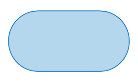
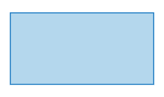
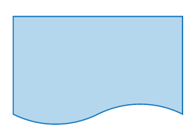
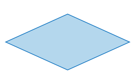
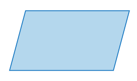
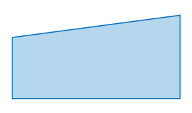

# Ejercicios ACTIVIDAD ALGORITMOS

## Ejercicio 1
Investiga cuáles son los símbolos que se utilizan para representar cada operación de un algorimo con un diagrama de flujo. Asegúrate de que la fuente es confiable, discute lo que encontraste con tus compañeros y con el profe. Cuando estés seguro/a de tener los símbolos correctos, consigna la información en la bitácora.

### 2. Símbolo de Inicio / Final
El símbolo de terminación marca el punto inicial o final del sistema. 



### 2. Símbolo de Acción o Proceso
Un rectangulo solo puede representar un solo paso dentro de un proceso.



### 3. Símbolo del Documento Impreso
Un documento o informe impreso.



### 4. Símbolo de Decisión o Ramificación
Un punto de decisión o ramificación. Las líneas que representan diferentes decisiones surgen de diferentes puntos del diamante.



### 5. Símbolo de Entrada / Salida
Representa el material o la información que entra o sale del sistema, como una orden del cliente (entrada) o un producto (salida).



### 6. Símbolo de Entrada Manual
Representa un paso en el que se pide al usuario que introduzca la información manualmente.




## Ejercicio 2
Analicemos el siguiente problema y representemos su solución mediante un algoritmo secuencial.

Construye un algoritmo que, al recibir como datos **el ID** del empleado y los seis primeros sueldos del año, calcule el ingreso total semestral y el promedio mensual, e imprima el ID del empleado, el ingreso total y el promedio mensual.

## Ejercicio 3
- Realice un algoritmo para determinar cuánto se debe pagar por equis cantidad de Lápices considerando que si son 1000 o más el costo es de $85 cada uno; de lo contrario, el precio es de $90. Represéntelo con el pseudocódigo y el diagrama de flujo.

|Variables| Tipo| Comentario|
|---------|-----|-----------|
|Lápices | Entrada| Cantidad de Lápices|
|Precio | Salida| Precio total de Lápices|
|85,90 | Contantes| No cambian|

## Pseudocódigo

```
Inicio
Leer Lápices
si Lápices>=1000:
    valor_unidad = 85
Si no 
    valor_unidad = 90
Fin Si
Precio = Lápices * valor_unidad
Escribir "El valor total es:", Precio
Fin

```

![foto de diagrama] (diagrama1.PNG)

4.  Un almacén de ropa tiene una promoción: por compras superiores a $250 000 se les aplicará un descuento de 15%, de caso contrario, sólo se aplicará un 8% de descuento. Realice un algoritmo para determinar el precio final que debe pagar una persona por comprar en dicho almacén y de cuánto es el descuento que obtendrá. Represéntelo mediante el pseudocódigo y el diagrama de flujo.

## Análisis

|Variables| Tipo| Comentario|
|---------|-----|-----------|
|Totalcompra| Entrada|Valor bruto de la compra |
|Preciofinal| Salida | precio a pagar con el descuento aplicado|
|descuento | salida| |Descuento según el valor de la compra |
|15% / 8% / $250000 |constantes|descuentos que se pueden aplicar, valor de referencia|

## Pseudocódigo

```
Inicio
Leer totalcompra
si totalcompra <250000:
  descuento=totalcompra*0.15
si no
  descuento=totalcompra*0.08
Fin si
preciofinal=totalcompra-descuento
Escribir "Valor a pagar:" , preciofinal, ". Se hizo n descuento de", 
descuento
Fin

```

5. El director de una escuela está organizando un viaje de estudios, y requiere determinar cuánto debe cobrar a cada alumno y cuánto debe pagar a la compañía de viajes por el servicio. La forma de cobrar es la siguiente: si son 100 alumnos o más, el costo por cada alumno es de $65.00; de 50 a 99 alumnos, el costo es de $70.00, de 30 a 49, de $95.00, y si son menos de 30, el costo de la renta del autobús es de $4000.00, sin importar el número de alumnos.

## Análisis
|Variables| Tipo| Comentario|
|---------|-----|-----------|
|Alumno| Entrada|Cantidad de alumnos |
|costoalumnos| Salida | precio a pagar de los alumnos|
|costototal| salida| |Costo a pagar de los alumnos y autobus |
|alumnos >= 100 / 50 <= alumnos < 100 / 30 <= alumnos <50 / alumnos <30 / $4000 |constantes|rango de alumnos|

## Pseudocódigo

```
Inicio
Leer alumnos
Si alumnos >= 100:
  costoalumno=65.00
  costototal:= costoalumno*alumno
    Si no:
     Si 50 <= alumnos <100
     costoalumno=70.00
     costototal= costoalumno*alumno
       Si no:
         Si 30 <= alumnos <50
         costoalumno=95.00
         costototal= costoalumno*alumnos
         Si no:
         Si alumnos <30
          costototal=4000
          costoalumno=costototal/alumno
          Fin si
    Fin si
Fin si
Escribir "Costo total:", cotoalumno
Fin

 ```

## Ejercicio de tarea:
Se realiza un diagrama para determinar la edad actual, con los siguientes datos: Día, mes y año de nacimiento y el día, mes y año actual.


# _Bucles_
## Ejercicios:

1. Se requiere un algoritmo para determinar, de N cantidades, cuántas son cero, cuántas son menores a cero, y cuántas son mayores a cero.
Realice el diagrama de flujo y el pseudocódigo. Representarlo usando el cliclo apropiado.

## Pseudocódigo

```
Inicio 
Leer N
Ceros = 0
mayores = 0
menores = 0
Mientras N > 0: 
 Leer cant
 Si cant > 0
   mayores= mayores + 1
Si no
    Si cant = 0
      ceros = ceros + 1
    Si no
      menores = menores + 1
    Fin si
  Fin si
  N = N - 1
Fin Mientras
Mostrar ceros, mayores, menores
Fin

```

2. Calcular el Factorial de un número entero ingresado por el usuario.

```
Inicio
Leer N
Factorial = 1
Mientras N > 0:
  Factorial = N* (N - 1)
    Si no
      Si N < 0  
       "Sin valor"
    Fin si
Fin Mientras
Escribir "Factorial" Factorial
Fin

```


# Tarea de Bucles:

Se requiere un algoritmo para obtener la estatura promedio de un grupo de personas, cuyo número de miembros se desconoce, el ciclo debe efectuarse siempre y cuando se tenga una estatura registrada. Realice el diagrama de flujo, el pseudocódigo y el diagrama N/S para representarlo, utilizando el ciclo apropiado.

### Pseudocódigo
 
1. arrojar el promedio cuando el usuario lo solicite
 
```
Inicio
Escribir "Para acabar el conteo y obtener el promedio, presionar la tecla F."
estatura_Total = 0
personas = 0
finconteo = 0
Mientras finconteo ≠ F
  Leer estatura
  Si estatura ≠ F:
    estaturaTot = estatura_Total + estatura
    npersonas = personas + 1
  FinSi
  finconteo = estatura
FinMientras
estaturaProm = estaturaTotal / personas
Escribir estaturaProm
Fin
 
```
 
2. arroja el promedio mediante el usuario va metiendo datos, pero no tiene fin
 
```
Inicio
estaturaTot = 0
npersonas = 0
Mientras estaturaTot >= 0
  leer estatura
  estaturaTot = estaturaTot + estatura
  npersonas = npersonas + 1
  estaturaProm = estaturaTot / npersonas
  Escribir estaturaprom
FinMientras
Fin  
```
 
### 2. Consultar cómo funcionan las tarjetas de crédito. Asumir una tasa de interés fija (2%). Preguntar al usuario el valor de la compra y el número de cuotas. Calcular y mostrar en pantalla. El valor de cada una de las cuotas que debe pagar hasta saldar la deuda.
 
#### Tarjetas de crédito:
- Cuando compras algo con tarjeta de crédito, no pagas todo al instante, sino que pagas en cuotas (mensuales generalmente).
 
- Si pagas todo en el mes, no te cobran intereses.
 
- Si decides pagar en cuotas, te cobran un interés fijo o variable sobre el saldo que tienes.
 
- El interés se aplica sobre el monto total de la compra para calcular cuánto debes pagar en total.
 
#### Pseudocódigo
 
```
Inicio
tasa = 0.02
Leer valor_compra, número_cuotas
totalintereses = valorcompra * tasa * ncuotas
totalpagar = valorcompra + totalintereses
valorCuota = totalpagar / ncuotas
Escribir totalpagar, valorCuota
Fin

```
 